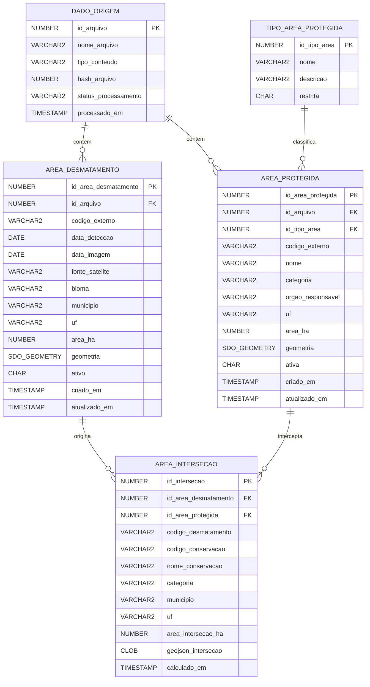

# SIMDE — Monitoramento de Desmatamento em Áreas Protegidas

Projeto da Global Solution (FIAP, Engenharia de Software). O sistema cruza
**alertas de desmatamento** por satélite com os **limites de áreas protegidas**
(Unidades de Conservação federais do ICMBio e Terras Indígenas da FUNAI),
identifica as **interseções** — desmatamento ocorrendo dentro de área protegida —
e expõe o resultado em uma API para visualização em mapa.

A interseção é o produto: ela é o indício de desmatamento potencialmente ilegal
dentro de uma área protegida, pronto para fiscalização.

---

## Stack

| Camada | Tecnologia |
|---|---|
| Linguagem | Java 21 |
| Framework | Spring Boot 4.0.6 (Web MVC + JDBC / `JdbcTemplate`) |
| Banco | Oracle Database + Oracle Spatial (`SDO_GEOMETRY`) |
| Driver | `ojdbc11` |
| Leitura de arquivos geo | GeoTools 31.2 (leitura de Shapefile e GeoPackage na ingestão) |
| Pool de conexão | HikariCP |
| Front-end | React + Leaflet (consome a API de interseções) |

---

## Arquitetura

```
Arquivos geo (Shapefile / GeoPackage)
        │  (ingestão — GeoTools lê e converte para WKT)
        ▼
┌──────────────────────────────┐
│  Spring Boot (Java)          │
│  - Ingestão das áreas        │  ── grava geometrias no Oracle (SRID 4674)
│  - Materialização da         │
│    interseção (Oracle Spatial)│
│  - API REST (GeoJSON)        │
└───────────┬──────────────────┘
            │ JDBC
            ▼
┌──────────────────────────────┐
│  Oracle + Oracle Spatial     │
│  - Geometrias em SIRGAS 2000 │
│  - Cruzamento espacial        │
│    (SDO_ANYINTERACT /         │
│     SDO_INTERSECTION)         │
└──────────────────────────────┘
            ▲ GET /api/intersecoes (GeoJSON em 4326)
            │
        React + Leaflet
```

- As geometrias são armazenadas em **SIRGAS 2000 (SRID 4674)**.
- O cruzamento espacial roda no Oracle. O resultado é **pré-processado**:
  no startup a aplicação materializa as interseções na tabela `AREA_INTERSECAO`,
  já com o GeoJSON em **WGS84 (SRID 4326)** pronto para o Leaflet.
- O front consome um único endpoint e não fala com o banco diretamente.

---

## Modelo de Dados

Cinco tabelas. Áreas protegidas, áreas de desmatamento e a interseção entre elas
formam o núcleo; `DADO_ORIGEM` registra os arquivos processados e
`TIPO_AREA_PROTEGIDA` classifica as áreas.



| Relacionamento | Cardinalidade |
|---|---|
| `DADO_ORIGEM` → `AREA_PROTEGIDA` | 1:N |
| `DADO_ORIGEM` → `AREA_DESMATAMENTO` | 1:N |
| `TIPO_AREA_PROTEGIDA` → `AREA_PROTEGIDA` | 1:N |
| `AREA_DESMATAMENTO` → `AREA_INTERSECAO` | 1:N |
| `AREA_PROTEGIDA` → `AREA_INTERSECAO` | 1:N |

---

## Pré-requisitos

- JDK 21
- Maven 3.9+ (ou o wrapper incluído: `./mvnw` / `.\mvnw.cmd`)
- Acesso à rede FIAP (presencial ou VPN) para o Oracle
- Cliente SQL (DBeaver ou SQL Developer)

---

## Configuração

O perfil ativo padrão é `dev`. As credenciais são lidas de um arquivo de
ambiente em `config/.env-dev.properties` (não versionado):

```
ORACLE_DB_URL=jdbc:oracle:thin:@ORACLE.FIAP.COM.BR:1521:ORCL
ORACLE_DB_USERNAME=<rm_usuario>
ORACLE_DB_PASSWORD=<senha>
```

---

## Preparar o banco

Execute na ordem, no DBeaver:

1. **Script de schema** — cria `DADO_ORIGEM`, `TIPO_AREA_PROTEGIDA`,
   `AREA_PROTEGIDA` e `AREA_DESMATAMENTO`.
2. **`database/ddl_intersecao.sql`**, executando uma instrução por vez:
   - **Seção 1** — metadata em `USER_SDO_GEOM_METADATA` e índices espaciais
     (`MDSYS.SPATIAL_INDEX`, SRID 4674) nas duas tabelas de origem.
     **Obrigatório**: sem o índice espacial, o cruzamento fica inviável.
   - **Seção 2** — cria a tabela `AREA_INTERSECAO`.

A carga das geometrias é feita pela ingestão da aplicação (GeoTools).
Como ela é lenta, **o banco de avaliação já deve ser entregue populado**.

---

## Executar

```
mvn spring-boot:run
```
(ou `.\mvnw.cmd spring-boot:run` no PowerShell)

A aplicação sobe em `http://localhost:8080`.

### Flags de inicialização

| Propriedade | Padrão | Função |
|---|---|---|
| `prodes.import-on-startup` | `false` | Lê os GeoPackage de desmatamento de `input/` e grava no banco |
| `conservation-area.import-on-startup` | `false` | Lê os Shapefile de áreas protegidas de `input/` e grava no banco |
| `intersecao.materializar-on-startup` | `true` | Recalcula as interseções e grava as novas em `AREA_INTERSECAO` |

Com o banco já carregado, mantenha os dois `import-on-startup` em `false`
(a ingestão apaga e regrava tudo, e leva muito tempo). A materialização da
interseção é incremental — só grava pares novos.

---

## Endpoints

| Método | Rota | Descrição |
|---|---|---|
| `GET` | `/api/intersecoes` | Devolve as interseções como GeoJSON `FeatureCollection` (geometria em 4326 + atributos), pronto para o Leaflet |
| `POST` | `/api/intersecoes/recalcular` | Recalcula as interseções sob demanda |

Exemplo de feature retornada:

```json
{
  "type": "Feature",
  "geometry": { "type": "MultiPolygon", "coordinates": [ ... ] },
  "properties": {
    "id": 1,
    "nomeConservacao": "...",
    "categoria": "...",
    "municipio": "...",
    "uf": "PA",
    "areaIntersecaoHa": 12.34
  }
}
```

---
