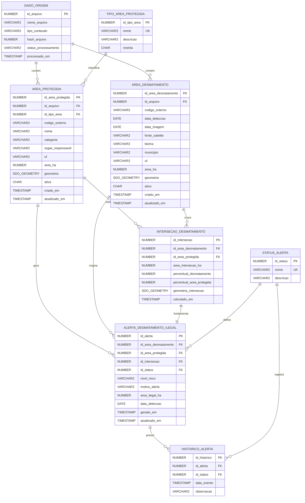

# Diagrama Entidade-Relacionamento

Sistema para processar arquivos GeoJSON de áreas protegidas/restritas e áreas de desmatamento ativo, processar os dados com Java/Spring, calcular intersecoes espaciais e registrar alertas de desmatamento ilegal.

Banco de dados alvo: Oracle Database com Oracle Spatial  
Backend: Java / Spring Boot  
Frontend: React  
Entrada de dados: arquivos GeoJSON locais ou internos ao projeto

## Diagrama ER



## Tabelas principais

| Tabela | Finalidade |
| --- | --- |
| `DADO_ORIGEM` | Registra os arquivos GeoJSON fixos processados pelo backend. Pode armazenar áreas protegidas ou áreas de desmatamento. |
| `AREA_PROTEGIDA` | Guarda as geometrias das áreas restritas/protegidas vindas do GeoJSON. |
| `AREA_DESMATAMENTO` | Guarda as geometrias das áreas de desmatamento detectadas no momento. |
| `INTERSECAO_DESMATAMENTO` | Armazena o resultado do cruzamento espacial entre desmatamento e área protegida. |
| `ALERTA_DESMATAMENTO_ILEGAL` | Registra os casos em que uma área de desmatamento cruza uma área protegida/restrita. |
| `HISTORICO_ALERTA` | Mantém a evolução temporal do alerta, como aberto, em analise, confirmado ou resolvido. |

## Relacionamentos

| Relacionamento | Cardinalidade | Descricao |
| --- | --- | --- |
| `DADO_ORIGEM` -> `AREA_PROTEGIDA` | 1:N | Um arquivo GeoJSON de áreas protegidas pode conter varias features. |
| `DADO_ORIGEM` -> `AREA_DESMATAMENTO` | 1:N | Um arquivo GeoJSON de desmatamento pode conter varias features. |
| `TIPO_AREA_PROTEGIDA` -> `AREA_PROTEGIDA` | 1:N | Cada área protegida pertence a um tipo ou categoria. |
| `AREA_DESMATAMENTO` -> `INTERSECAO_DESMATAMENTO` | 1:N | Uma área de desmatamento pode cruzar uma ou mais áreas protegidas. |
| `AREA_PROTEGIDA` -> `INTERSECAO_DESMATAMENTO` | 1:N | Uma área protegida pode ser atingida por varias áreas de desmatamento. |
| `INTERSECAO_DESMATAMENTO` -> `ALERTA_DESMATAMENTO_ILEGAL` | 1:1 | Uma intersecao valida gera um alerta de desmatamento ilegal. |
| `STATUS_ALERTA` -> `ALERTA_DESMATAMENTO_ILEGAL` | 1:N | Cada alerta possui um status atual. |
| `ALERTA_DESMATAMENTO_ILEGAL` -> `HISTORICO_ALERTA` | 1:N | Cada alerta pode ter varios eventos historicos. |

## Fluxo recomendado

1. O backend Java/Spring le os arquivos GeoJSON fixos do projeto ou de uma pasta configurada.
2. Para cada arquivo, registra ou atualiza um item em `DADO_ORIGEM`.
3. Se o arquivo for de áreas protegidas, grava as features em `AREA_PROTEGIDA`.
4. Se o arquivo for de desmatamento, grava as features em `AREA_DESMATAMENTO`.
5. O backend calcula a intersecao entre `AREA_DESMATAMENTO.geometria` e `AREA_PROTEGIDA.geometria`.
6. Cada cruzamento encontrado e salvo em `INTERSECAO_DESMATAMENTO`.
7. Se a área protegida estiver ativa e for restrita, o sistema cria um registro em `ALERTA_DESMATAMENTO_ILEGAL`.
8. O React consulta a API Spring para exibir mapa, lista de alertas, filtros por data, risco, UF e status.

## Observacoes para armazenamento no Oracle

- As geometrias devem ser armazenadas como `MDSYS.SDO_GEOMETRY`.
- O campo `hash_arquivo` ajuda a identificar se o arquivo fixo mudou e evita reprocessamento desnecessario:
  - 1 = Processado
  - 0 = Não processado
- `tipo_conteudo` em `DADO_ORIGEM` pode receber valores como:
  - `AREA_PROTEGIDA`
  - `DESMATAMENTO`
- `restrita` em `TIPO_AREA_PROTEGIDA` pode ser `S` ou `N`.
- `ativo` em `AREA_DESMATAMENTO` indica se aquele desmatamento ainda esta sendo considerado no monitoramento atual.
- `ativa` em `AREA_PROTEGIDA` indica se a área protegida ainda deve ser considerada no cruzamento.

## Sugestao de status de alerta

| Status | Descricao |
| --- | --- |
| `ABERTO` | Alerta gerado automaticamente apos intersecao com área protegida. |
| `EM_ANALISE` | Alerta esta sendo analisado. |
| `CONFIRMADO` | Desmatamento ilegal confirmado. |
| `DESCARTADO` | Alerta descartado por falso positivo ou inconsistencia nos dados. |
| `RESOLVIDO` | Caso tratado ou encerrado. |

## Sugestao de indices

```sql
CREATE INDEX idx_area_protegida_geom
ON area_protegida(geometria)
INDEXTYPE IS MDSYS.SPATIAL_INDEX;

CREATE INDEX idx_area_desmatamento_geom
ON area_desmatamento(geometria)
INDEXTYPE IS MDSYS.SPATIAL_INDEX;

CREATE INDEX idx_intersecao_geom
ON intersecao_desmatamento(geometria_intersecao)
INDEXTYPE IS MDSYS.SPATIAL_INDEX;

CREATE INDEX idx_desmatamento_data
ON area_desmatamento(data_deteccao);

CREATE INDEX idx_alerta_status
ON alerta_desmatamento_ilegal(id_status);

CREATE INDEX idx_alerta_data
ON alerta_desmatamento_ilegal(data_deteccao);

CREATE INDEX idx_historico_alerta
ON historico_alerta(id_alerta, data_evento);
```

## Exemplo de regra de alerta

Um alerta de desmatamento ilegal deve ser criado quando:

```text
AREA_DESMATAMENTO.geometria intercepta AREA_PROTEGIDA.geometria
E AREA_PROTEGIDA.ativa = 'S'
E TIPO_AREA_PROTEGIDA.restrita = 'S'
E area_intersecao_ha > 0
```

O campo `area_ilegal_ha` em `ALERTA_DESMATAMENTO_ILEGAL` deve receber o valor de `INTERSECAO_DESMATAMENTO.area_intersecao_ha`.
